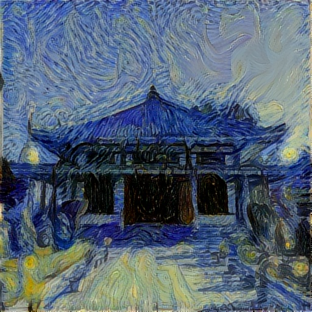
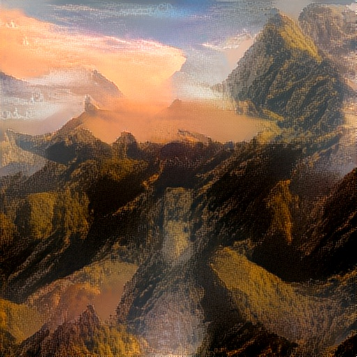
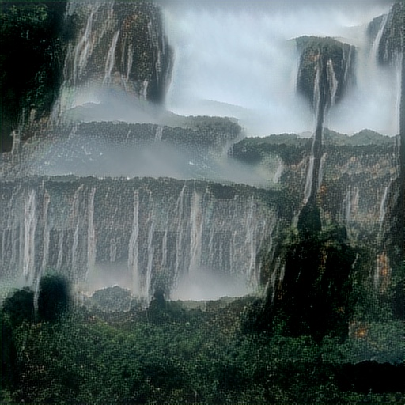

# Neural Style Transfer

Neural Style Transfer using Transfer Learning in Keras and TensorFlow

## Project Structure

There is only one ipnyb file that includes the code for generation of new image when a content and style image is given.

### Approach
I have used a VGG16 which is a pretrained CNN model containing 16 layers. I passed a content image, a style image, and a generated image (randomly generated or initialized as one of content or style image) through the model.

### Losses
- **Content Loss:** Chose a layer from the model to calculate content loss. Minimizing this loss tries to build the outline of the content image in the generated image.
- **Style Loss:** Chose 5 layers from the model to calculate style loss. Minimizing this loss tries to build the style of the style image in the generated image.
- **Variation Loss:** To reduce noise in the generated image.
- **Total Loss:** Weighted sum of all losses is calculated and minimized.

### Optimizer
As mentioned in the research paper by Leon Gatys et al., I have used BFGS algorithm (An Iterative Nonlinear optimization method) of scipy to minimize loss. Instead, we can also use the Adam optimizer or any other to minimize loss.

### Choosing layers
**Content Layer:**
- As I have initialized the generated image with the content image, I have the option to choose the content layer from anywhere in the model.
**Style Layers:**
- There are no constraints to choose style layers; we can choose from anywhere in the model.

## Results

| Content Image | Style Image | Generated Image |
|:-------------:|:-----------:|:---------------:|
|  |  |  |
|  |  |  |
|  |  |  |

